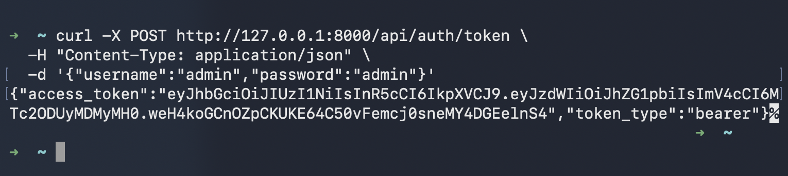
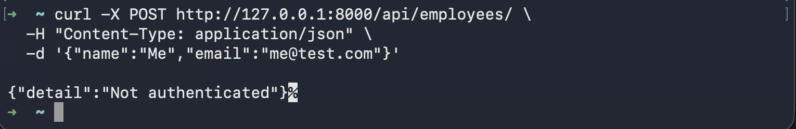
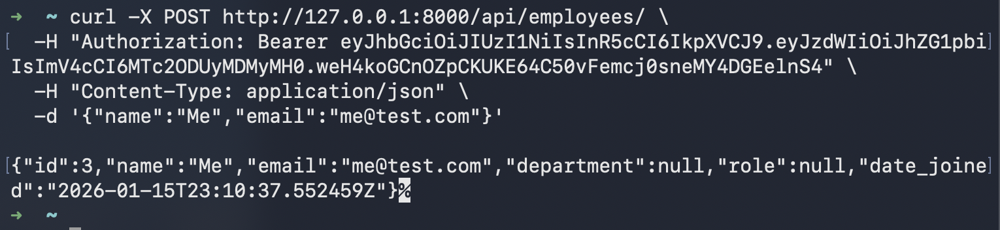

# Habot - hiring project (Python Backend Developer)


## Run locally - 

1. Clone the repository 
```bash
git clone https://github.com/yshvrd/HabotProject
cd HabotProject
```

2. Create and a run a virtual environment 
```bash
python3 -m venv .venv 
source .venv/bin/activate  #mac
```

3. install dependencies 
```bash
pip install -r requirements.txt
```

4. Run the DB and create table

```bash
docker run -d \
  --name habot-db \
  -e POSTGRES_USER=habot \
  -e POSTGRES_PASSWORD=habot \
  -e POSTGRES_DB=habot-db \
  -p 5432:5432 \
  postgres:16
```
```bash
cd Backend 
python -m db.create_table 
```

5. Run the server 
```bash
uvicorn app:app --reload
```

## Test Endpoints

1. generate auth token 
```bash
curl -X POST http://127.0.0.1:8000/api/auth/token \
  -H "Content-Type: application/json" \
  -d '{"username":"admin","password":"admin"}'
```



2. Test endpoints

```bash
curl -X POST http://127.0.0.1:8000/api/employees/ \
  -H "Content-Type: application/json" \
  -d '{"name":"Me","email":"me@test.com"}'
```


```bash
curl -X POST http://127.0.0.1:8000/api/employees/ \
  -H "Authorization: Bearer <TOKEN>" \
  -H "Content-Type: application/json" \
  -d '{"name":"Alice","email":"alice@test.com"}'
```



```bash
# list all employees
curl http://127.0.0.1:8000/api/employees/ \
  -H "Authorization: Bearer <TOKEN>"
```

```bash
# list employees (pagination)
curl http://127.0.0.1:8000/api/employees/?page=2 \
  -H "Authorization: Bearer <TOKEN>"
```

```bash
# list employees (filter by)
curl http://127.0.0.1:8000/api/employees/?department=Engineering \
  -H "Authorization: Bearer <TOKEN>"

```

```bash
# update employee
curl -X PUT http://127.0.0.1:8000/api/employees/<EMPLOYEE_ID> \
  -H "Authorization: Bearer <TOKEN>" \
  -H "Content-Type: application/json" \
  -d '{"role":"Manager"}'
```

```bash
# delete employee
curl -X DELETE http://127.0.0.1:8000/api/employees/<EMPLOYEE_ID> \
  -H "Authorization: Bearer <TOKEN>"
```

