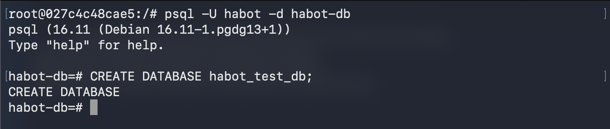
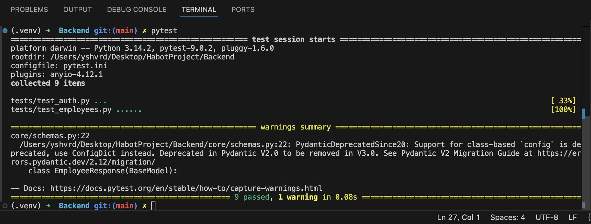

# tests README 

Before running tests, a simple setup is required, follow the instructions -


1. Create a Test DB
```bash
docker exec -it <container id>
```
```bash
psql -U habot -d habot-db
```
```bash
CREATE DATABASE habot_test_db;
```


2. Run file 
```bash
cd Backend 
pytest tests/conftest.py
```
```bash
# run all tests 
cd Backend 

pytest
```


Note - Any warnings displayed while running tests are non-blocking and unrelated to functional errors. All tests passing indicates correct API behavior as intended.
